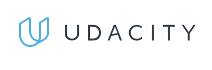

## Udacity - Programming for Data Science
This repository holds exercises and projects from the Programming for Data Science nandegree by Udacity. There were three main lessons to this nanodegree:

   - Learn how to use SQL.

   - Learn the basics of python necessary enough to get started in data Science.

   - Learn version control in the context of Git and make a repository on GitHub.

There are two projects that were necessary to complete this nanodegree which I will describe in the next section.

## Projects

There were two main projects necessary to complete this nanodegree.  I will describe each briefly below:

   1. Use a SQL to explore a database related to movie rentals. I performed this project by using SQL to query the data I needed and write the data to a csv. In this project I used anywhere from basic to more advanced query techniques such as JOINs, subqueries and window functions in order to obtain my data. The data, SQL scripts and presentations/reports can be found in the *project_1* directory.

   2. Use Python to explore data related to bike share systems for three major cities in the United States - Chicago, New York City and Washington. It is a basic script that imports the data and answers questions about the data by computing descriptive statistics. In addition, basic control flow was used in order to give the user of the script an interactive experience. The *Usage* section will give instructions on how to execute the python script for this project.

## Important Files (by directory)

### project_1
   - All SQL queries can be found in for this project can be found in *Project1_SQL_Programming_For_Data_Science.sql*.

   - Each individual question and data for that question can be found in the Excel files. Excel was where I analyzed the data and made the visualizations.

   - The powerpoint/slide deck can be found in *project1_Jared_Thacker.pdf* and *project1_Jared_Thacker.pptx*. In these files you can find the questions I decided to answer and the visualizations to support the answer

### project_2
   - The script for this project is named *bikeshare.py*.

   - There's also an additional README in this folder giving a very basic description of this project. Back when I completed this nanodegree I didn't know what markdown was, so be gentle :)

### sql_exercises
   - In this folder you can see a lot of SQL scripts that I wrote to complete various quizzes in the SQL module/lesson of the nanodegree. This folder was mainly meant for me to be able to come back and review if necessary, so there are not a lot of comments, but I the main takeaway is that I practiced A LOT of SQL for this nanodegree.

### pythonLesson
   - In this directory you can find various scripts that I used to answer various quiz questions throughout the course. Again, this directory was mostly meant for me so there are very little comments.

## Usage
The only project that this section really only applies to is project 2. In order to run the script enter the following into the command line:
   - ```python3 bikeshare.py```

Then answer the following questions by the command line prompt and the script will compute various descriptive statistics and such.

## License (MIT)
[](https://opensource.org/licenses/MIT)
